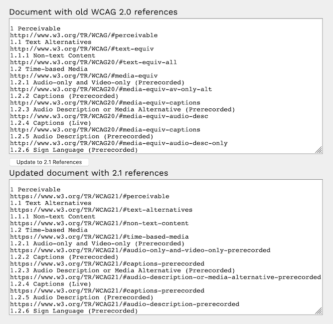

# WCAG-mappings

Some docs showing how WCAG 2.0 references map to their WCAG 2.1 equivalents. 

If you need to update some dusty old documentation, this might be a useful quick reference for you.

* [WCAG 2.0 and 2.1 SC Equivalents Table](wcag-2.0-and-2.1-SC-equivalents---table.html)
* [WCAG 2.0 and 2.1 'Understanding' Docs Equivalents Table](wcag-2.0-and-2.1-Understanding-equivalents---table.html)
* [WCAG 2.0 and 2.1 Reference 'Techniques' Mappings](wcag-2.0-and-2.1-techniques-equivalents---table.html)

You can also use this [convertor](convertor.html) if you have a document that you want to update in a jiffy.

